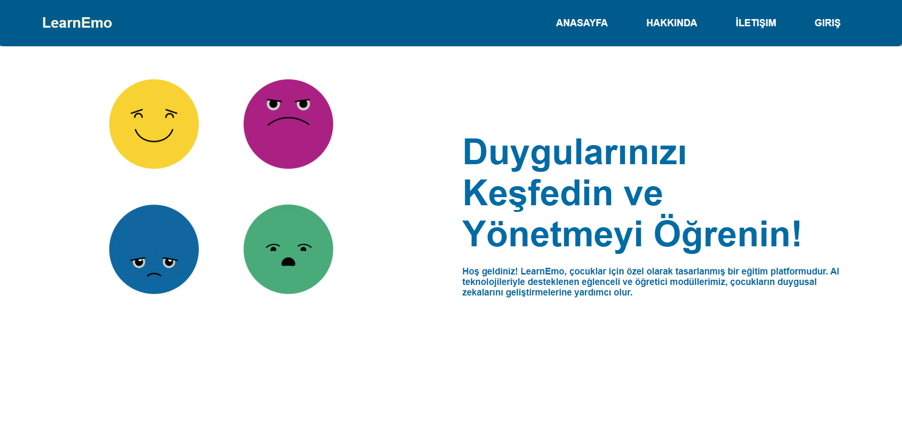
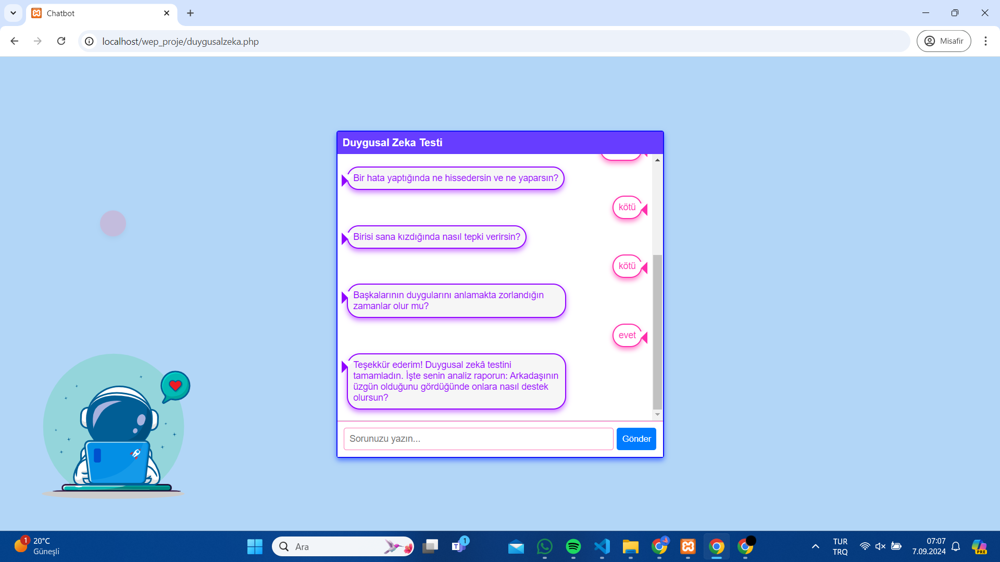
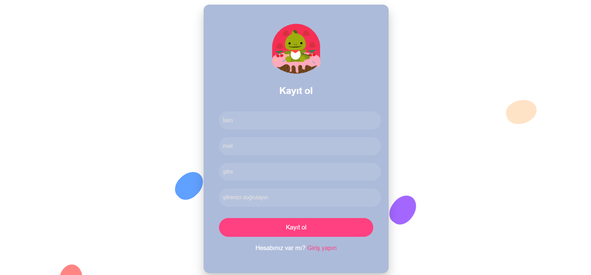

*Bu proje TEKNOFEST 2024 Antalya T3AI Hackathon Yarışması Uygulama Geliştirme Kategorisi için geliştirilmiştir.*

# EmoLearn

## Projede Ne Amaçlanıyor?

EmoLearn, çocukların duygusal zeka becerilerini artırmayı amaçlayan AI destekli bir eğitim platformudur. Çocuklara duygusal farkındalık, etkileşim testleri ve stres yönetimi konusunda rehberlik ederek, duygusal becerilerini geliştirmelerine yardımcı olur.


## Uygulamadan Ekran Görüntüleri






## Uygulamayı Lokalde Çalıştırma

1. **Depoyu Klonla**:
   ```bash
   git clone https://github.com/yourusername/EmoLearn.git

1. **XAMPP Kurulumu**:
   - Proje klasörünü XAMPP'in `htdocs` dizinine yerleştirin.

2. **Veritabanı Yapılandırması**:
   - Sağlanan SQL dosyasını veritabanınıza import edin.

3. **Yapılandırma Dosyalarını Güncelleyin**:
   - `config.php` dosyasını veritabanı bilgilerinize uygun olarak düzenleyin.

4. **XAMPP'i Başlatın**:
   - XAMPP kontrol panelinden Apache ve MySQL servislerini başlatın.

5. **Uygulamayı Tarayıcıda Açın**:
   - Web tarayıcınızı açın ve `http://localhost/LearnEMO/index.php` adresine gidin.
